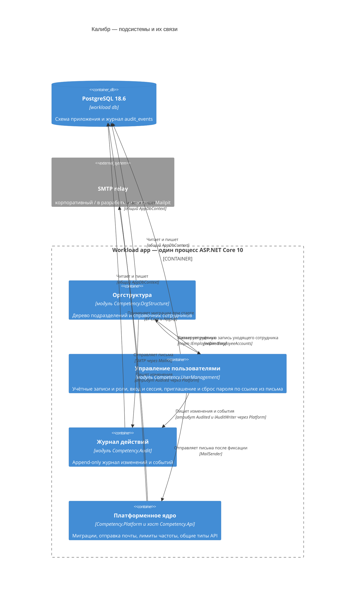

---
responsibility:
  owns: which subsystems exist and their ids (sole subsystem registry); diagram_tool mermaid: the subsystem diagram
  excludes: a subsystem's purpose and key paths, requirements, decisions, stack
  delegates_to: <id>.md (purpose, key paths), c4/ (likec4 diagram source), stack.html
---

# Subsystems

| Id | Name | Role |
|---|---|---|
| [org-structure](./org-structure.md) | Оргструктура | Дерево подразделений и справочник сотрудников (подразделение, должность, статус «работает / не работает»); источник сведений о сотруднике для остальных подсистем |
| [user-management](./user-management.md) | Управление пользователями | Локальные учётные записи, две роли, вход и сессия, приглашение и сброс пароля по ссылке из письма, привязка учётной записи к сотруднику, правило последнего активного администратора |
| [audit](./audit.md) | Журнал действий | Append-only журнал изменений и событий входа, приглашений, сброса пароля и отправки писем; чтение только глобальным администратором |

Общее ядро (`Competency.Platform`) и хост (`Competency.Api`) не подсистемы и в реестр не входят: их механизмы описаны в `stack.html` («Архитектурные принципы»), границы модулей — в `<id>.md`.

## Diagram

Узлы `platform-core`, `postgres` и `smtp-relay` — платформенное ядро и инфраструктура, не подсистемы.

